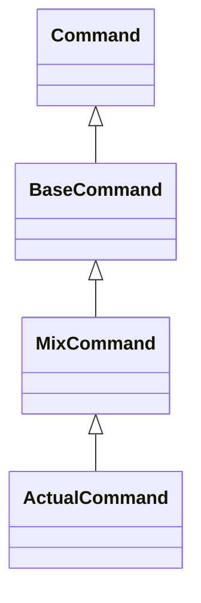

# Architecture
mix-cli provides users with an easy way to use the Mix V4 authoring API. It
offers atomic commands that can be scripted in sequence to implement workflows
that would be tedious to repeat manually using the Mix.dashboard tool. All
commands offer endpoint outputs in json format which can then be processed with
tools like [jq](https://stedolan.github.io/jq/).

## Foundations
mix-cli is built with the [oclif](https://oclif.io) framework and requires an
LTS version Node.js of 14 or more recent.

The [oclif framework documentation](https://oclif.io/docs/introduction.html)
provides a general overview of the framework architecture so this document will
focus on the elements that are specific to mix-cli.

## Commands
Since mix-cli basically mirrors the endpoints it calls under the hood,
commands follow a common _lifecycle_. The steps of the lifcycle are exposed
through methods that can be overridden in the implementation of individual
commands.  When authoring new commands for mix-cli, a good place to
start is looking at the source code of a command that offers similar
functionality.

Each command is described by a class that ultimately extends the oclif Command
class. mix-cli command names follow the convention _topic:action_. Each
command maps to a specific source code file under `src/commands`. For instance,
the source code for the "projects:create" command is found in
`src/commands/projects/create.ts`.

### Command class hierarchy
Each mix-cli command extends the MixCommand class which itself extends the
BaseCommand class. The BaseCommand class extends the oclif Command class.

The BaseCommand class provides methods to deal with acquiring, renewing and
storing access tokens. It also implements the `init()` method, one of the
lifecycle events exposed by oclif.

The MixCommand class provides methods and class members that define the
lifecycle of each mix-cli command. Follow this lifecycle to offer a
consistent user experience when authoring new commands.

## mix-cli command lifecycle
The `run()` method of the MixCommand class implements the mix-cli command
lifecycle. Actual mix-cli command classes extend the MixCommand class  and
override relevant methods. It should not be necessary write a `run()` method for
an actual mix-cli command class. The implementation of MixCommand is found in
`src/utils/base/mix-command.ts`. MixCommand methods are listed in their order of
use with respect to the command lifecycle.

The following sections describe each part of the lifecycle and give guidance
regarding what needs to be implemented when authoring a new command. Refer to
the implementation of existing commands for concrete examples.

### Configuration
The first step of the mix-cli command lifecycle is to read the configuration.
This is required for any command and is handled by default.

### Command flags
mix-cli uses named options only ("flags" in oclif parlance). The next step in
the lifecycle is to capture the options for use across the lifecycle. Actual
mix-cli command classes must implement the `captureOptions()` method. 

#### Standard flags
Most command flags are defined in `src/utils/flags.ts`. Import flags
from this module when authoring a new command as it will help keep the flag
descriptions consistent across commands. New command flags should be added to
this module for the same reason.

### Authentication
mix.cli retrieves the access token from file storage or renews it if
possible. This is required for any command and is handled by default.

### Watchable commands
Commands that obtain a job ID from calling an asynchronous endpoint can offer
the `--watch` flag. This will result in the command using `Jobs.getJob()` API to
automatically monitor the status of the job returned by the initial asynchronous
endpoint.

### Output format
The output format specified by the user is captured in the `selectedFormat` instance
property. It is used later on in the lifecycle of the command to output result data.

### Domain options validation
oclif provides basic built-in validation for string, integer and boolean flags.
Further validation of common flags is provided by the `tryDomainOptionsValidation()`
method of the MixCommand class. See see `src/utils/validations.ts` for details.
Override `tryDomainOptionsValidation()` to provide command-specific validation.
Call `super.tryDomainOptionsValidation()` in your override to ensure common flags
are validated.

### Request action message
mix-cli displays a message to the user right before calling the endpoint. The
default message is simply "Fetching". Override the `setRequestActionMessage()`
method to provide a message relevant to the command.

### Request parameters
Override the `buildRequestParameters()` method so it returns the list of
parameters expected by the API. 

### Command confirmation
Destructive commands must be confirmed. Commands are confirmed interactively by
having users answer a question of the form "Confirm _action_ by typing
_confirmationValue_". Both _action_ and _confirmationValue_ need to be provided
in the command implementation. Commands can be pre-confirmed by using the
`--confirm` flag with the expected _confirmationValue_.

A few things need to be set up to enable confirmation:

- Set the `shouldConfirmCommand` instance property on your command class to true
to enable confirmation in the lifecycle.

- Override the `expectedConfirmationValue()` method to return the expected
confirmation value.

- Set the `action` instance property to describe the action to confirm.
"destroy", "import", and "replace" are examples of actions used for building a
confirmation message in existing commands.  The chosen action must read
naturally in the following message: "Confirm _action_ by typing
_confirmationValue_".

- Override the `warnBeforeConfirmation()` method to provide a relevant warning
message in yellow color. The MixCommand class implements a default message.

### Command output
mix-cli supports 4 modes of output:

- The _human-readable format_ is the default output format and simply outputs
text or tabular data.

- The _json_ format provides raw data returned by the endpoint in JSON.

- The _yaml_ format provides raw data returned by the endpoint in YAML.

- The _csv_ format provides table data using comma-separated values and is meant
to be consumed by spreadsheet applications.

Authoring a command that provides json or yaml output only requires making the
relevant command flags available in the command; the rest is handled by default.

Override the `transformResponse()` method to extract and/or transform the
portion of the endpoint response data that is relevant to the human-readable and
csv output formats. When possible, the human-readable and csv format should
ultimately provide the same information.

Override the `outputHumanReadable()` method to output in that format. 

Make use of the `outputAsKeyValuePairs()` method to output response data that
can be expressed as a set of key-value pairs.

### Command errors
Errors are handled by the lifecycle implementation. Consult the implementation
of existing commands to see how to deal with errors in the methods you have to
override. Reuse the error classes found in `src/utils/errors.ts` to ensure a
consistent user experience. 